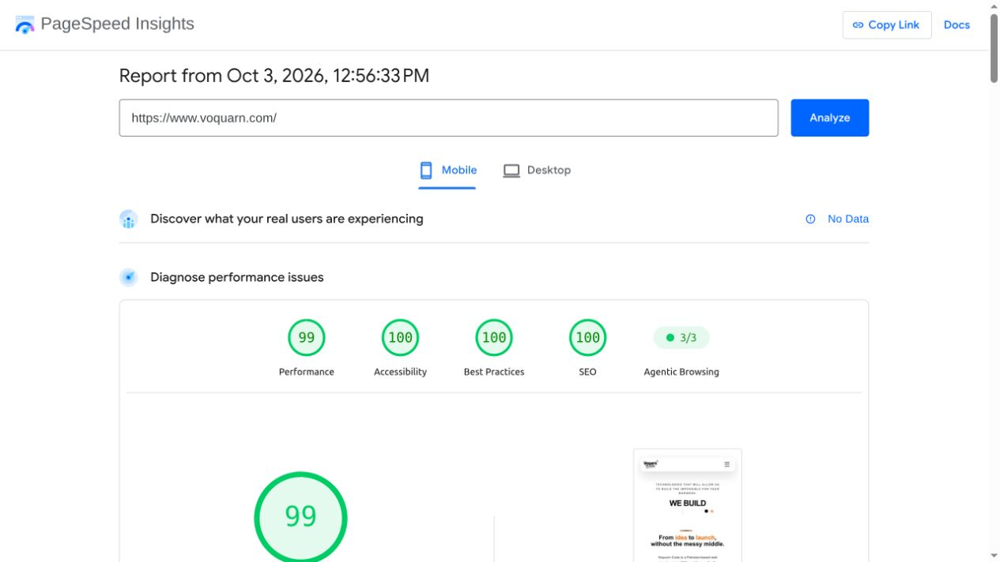

# Full blog discovery and performance verification — 3 October 2026

The owner requested publication discovery for every blog, superseding the previous 24-article restriction. Production now serves **4,433 unique sitemap URLs: all 4,418 published articles plus 15 main/service pages**. The blog library exposes all articles across **369 pages**, with search and topic filters. The sitemap's article set exactly matches the repository's published index; no missing, duplicate, private or filtered URLs were found. Its uncompressed size is 915,857 bytes.

## Discovery changes

- Removed cornerstone filtering from the sitemap, public blog listing and IndexNow submission. Removed archive-only `noindex` from article metadata.
- Kept the 24 cornerstone articles as the editorial-review and prebuilding set. Other articles render through on-demand ISR; this does not limit discovery.
- Preserved self-canonical pagination, filter `noindex`, article modification dates and outage protection. Sitemap dependency failure returns an uncached 503 rather than an incomplete successful XML document.
- `robots.txt` and the concise `llms.txt` both reference the full sitemap. `llms.txt` still contains a selected editorial summary, rather than reproducing thousands of article entries.

## Deployed speed and audit changes

Replaced the homepage enterprise selector's motion dependency with native React/CSS, deferred desktop decorative effects away from touch/reduced-motion visitors, corrected logo image sizing and disabled automatic prefetching of large blog navigation sets. Service data now has an hourly cache and admin mutations invalidate it.

Review photos now use Next.js responsive image optimization and native lazy loading within reserved aspect-ratio frames. The three review photos total **337,741 original bytes versus 64,748 bytes at 640px WebP: 80.8% less** for that image variant. Actual downloaded variants depend on viewport and pixel density. Initial same-origin homepage JavaScript measured **244,914 → 203,614 compressed bytes, a 16.9% reduction**; script count fell from 11 to 10. These are payload measurements, not a claim of a uniform load-time improvement for every visitor.

Fixed review-star ARIA roles, footer heading levels, descriptive service links and the three contrast failures identified in the first audit. Added only the exact analytics collection paths observed failing under the existing CSP, following [Google's CSP guidance](https://developers.google.com/tag-platform/security/guides/csp). Production script restrictions remain in force.

## Final mobile Lighthouse result

[Google PageSpeed report](https://pagespeed.web.dev/analysis/https-www-voquarn-com/dh4byafzdz?form_factor=mobile), captured **3 October 2026, 12:56 PM GMT+5** on emulated Moto G Power, Slow 4G, Lighthouse 13.5.0:

| Measure | Result |
| --- | --- |
| Performance | 99/100 |
| Accessibility | 100/100 |
| Best Practices | 100/100 |
| SEO | 100/100 |
| Experimental Agentic Browsing | 3/3 |
| First Contentful Paint | 1.2 s |
| Largest Contentful Paint | 2.0 s |
| Total Blocking Time | 40 ms |
| Cumulative Layout Shift | 0 |
| Speed Index | 1.4 s |

The earlier audit scored 99 performance, 91 accessibility, 92 best practices and 92 SEO. The final report clears its image-delivery, non-descriptive-link, heading-order, prohibited-ARIA and console-error failures. There is **no CrUX field data**; these are a single lab run and may vary. Automated accessibility/SEO scores do not establish full accessibility compliance, search rankings or answer-engine citations. Remaining performance opportunities include framework/analytics unused JavaScript, stylesheet blocking and two non-composited animations; the result does not claim that every possible optimization is complete.

## Verification and deployment

Code commits `e51c4aa` and `3ae4381` were pushed directly to `main`. The [final code deployment](https://vercel.com/moueen-togarvis-projects/voquarn-code/Fw5MSnPMmh9mQit1goauJwBuzr8k) completed successfully. Lint, TypeScript, SEO regression/data-error tests and diff checks passed. Final live checks covered 10 rendered routes plus robots/LLM discovery, full sitemap set equality, optimized images and all five homepage corrections. Mobile DOM checks found 375px client/scroll width, no service-link overflow and lazy review images.

[Machine-readable measurements](full-publication-performance-2026-10-03.json) accompany this report. The [earlier blog-refresh report](blog-refresh-2026-10-03.md) records six new articles, 18 substantive existing-article updates and the metadata refresh across the original corpus. **This follow-up does not rewrite the remaining repetitive archive bodies.** Its earlier body-quality findings still apply; all published articles are now exposed according to the owner's explicit request.

The supplied Search Console screenshot showed **30 discovered pages, last read 29 September**, which predates this deployment. Submit the existing [www sitemap URL](https://www.voquarn.com/sitemap.xml) again in Search Console to request a fresh read. Google controls recrawl and indexing; discovered URLs are not guaranteed indexed URLs. See [Google's Sitemaps report documentation](https://support.google.com/webmasters/answer/7451001?hl=en). Search Console was not resubmitted from this session. The previously observed platform-level apex 307 redirect still requires authenticated Vercel/domain access; the canonical www sitemap is directly accessible.
